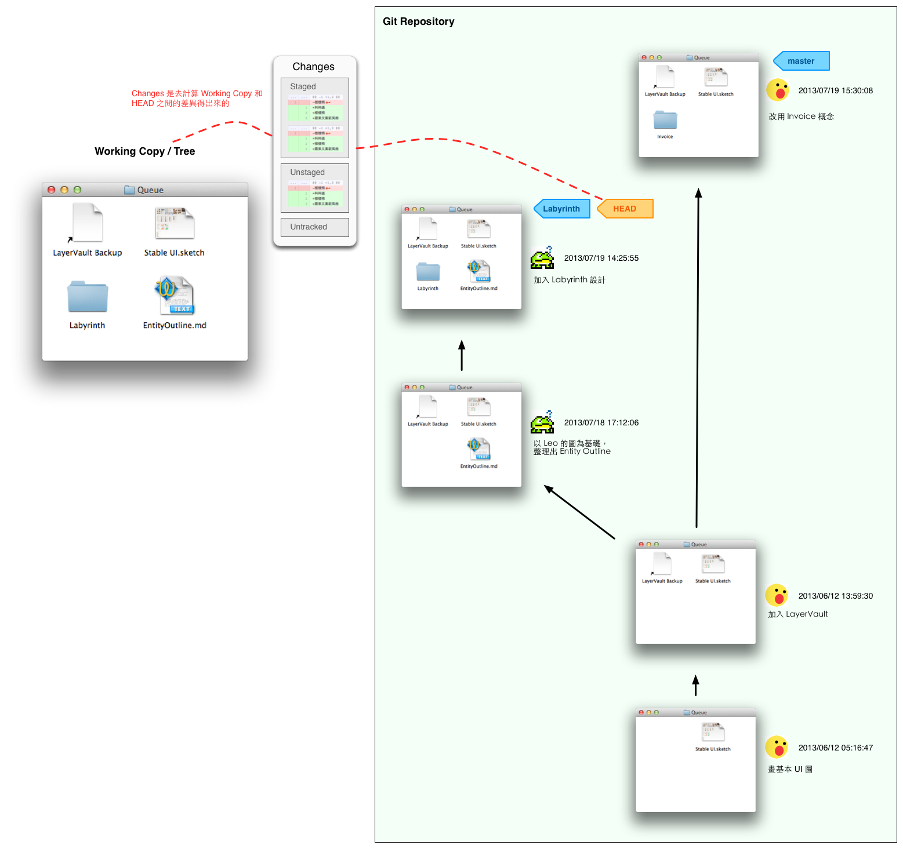

## Git 概念解釋

- **Working Copy 或 Working Tree**
  
  就是實際存在你 local 硬碟上的一個專案資料夾，你工作的時候都是對這邊的檔案進行操作。

- **Commit**
  
  概念上來說，就像 Time Machine 裡的一個 version，是某時刻的整個 working tree 的 snapshot。
  
  實際上包含以下幾個屬性：
  
  - Working Tree Snapshot
  - 作者
  - 時間
  - 說明
  - parent: 前一個 commit 是誰（知道這個資訊才能算出 diff）
  
  這些資訊會用一種叫 `sha1` 的函數算出一串亂碼，變成這個 commit 的代號。例如 `49b8b603f3c6389160499a972826ff362dd78ff0`。通常我們會簡寫前幾位，例如 `49b8b603`，只要不會有曖昧的情況就好。
  
  就算兩個 commits 的 working tree 檔案內容 snapshot 完全一樣，但只要作者、時間、說明或 parent 其中之一有不同，算出來的 `sha1` 也會不同，會被當成不同的 commit。
  
- **HEAD**
  
  指向你的 working tree 對應的 branch 或 commit。
  
- **Branch**
  
  隨著時間演進，commit 會形成一條條 path。Branch 指向某個 commit，代表這個 commit 是某個意義（你賦予這個 branch）的 path 的最終點、最新的版本。（示意圖中以藍色標籤表示，共有 master 和 Labyrinth 這兩個 branch）。
  
  git 預設的 branch 是 master。
  
  被 HEAD 指向的 branch 叫做 working branch。
  
- **Change**

  Working Copy 和 HEAD 之間檔案的差異。

- **Stage**

  Set of changes you want to commit。這是一個暫存區，可以挑選你要把哪些 changes 做成一個 commit。

   

